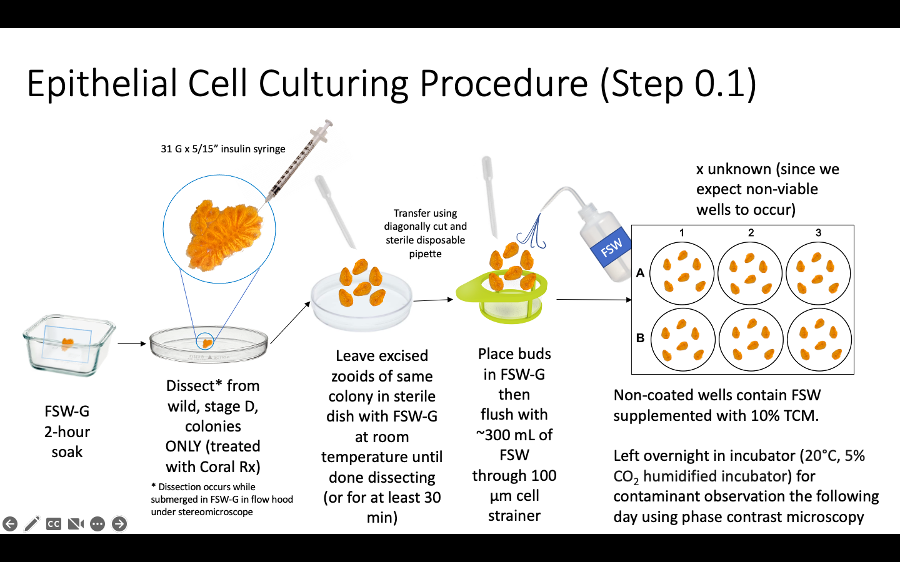
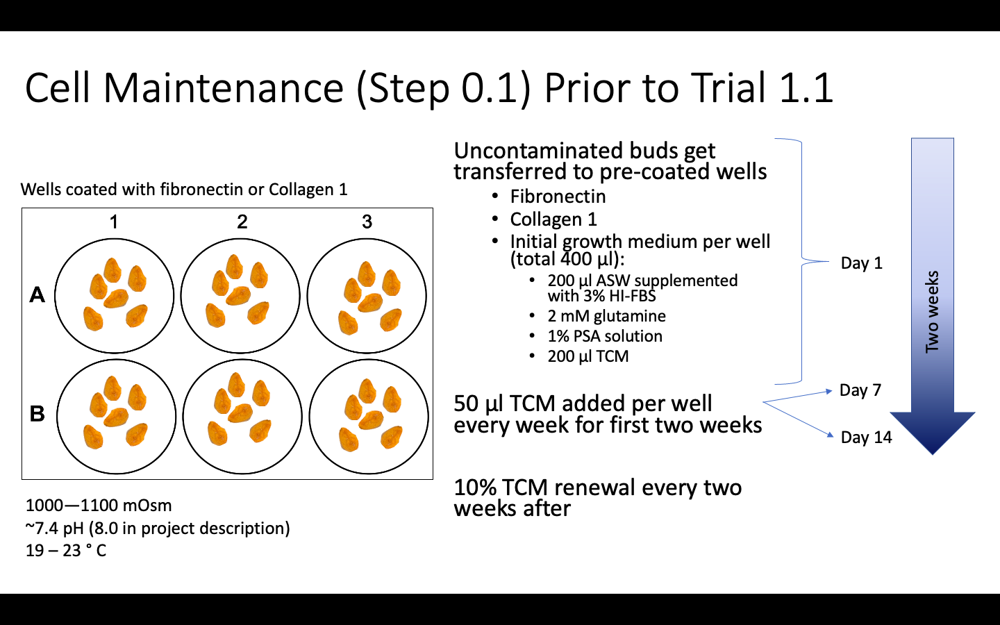

### 01-10-2023
This is my first daily post of the quarter. I think this may be a useful way of keeping accountable and reflecting on the smaller increments of progress completed day by day. Today was my first day back at the Tacoma campus for Winter Quarter 23'. I worked on getting the Gardell Lab website spruced up, working on a schematic for colony exposures with benzene[a]pyrene, organizing my library in Zotero, and finishing up the slides and Google Drive folders that will be needed for Aidan and I's first lab sessions this week.

### 01-11-2023
Today I TA'ed my first lab session for FISH 270. The experience went rather well and I learned how to help students structure smaller scale expirements like those done in this course. I also attended my FISH 549 course: Best practices in environmental data science. We were presented with some basic functions offered on GitHub such as creating projects, issues, and new repositories.

### 01-12-2023
I downloaded Visual Studio Code as a means of creating new Markdown files for my lab notebook. Prior to this, I was duplicating the previous Markdown file I used, modifying it, and pushing the new file to my Lab Notebook. I was orignally going to use Atom but upon re-downloading I saw that they were planning to "sunset" the platform so went with VS Code instead.  

I also went through all the containers in the recirculating seawater system at UWT to: 
-  scrub and siphon them out in preperation for new colonies that I plan to collect next week 
- relabel the containers to make a consistent ID system
- check if there were any live tunicates from before the Winter Break. 
    - There was only one live tunicate from the 12/12/22 collection date. This colony was alive, not adhered to the slide, ampullae were retracted, and had a relatively low blood circulation, but had no visible parasites. Colony was placed in a humidity chamber for the day and successfully adhered to the slide and placed back in container A1. 
    - There were also 24 oozoids adhered to three different slides. These oozoids were cleaned with a soft paint brush and transferred to an isolated oozoid tank (IO1 container) to be kept in stagnant water.

Today I also quickly created a Google Map that documents the collection sites for _Botryllus schlosseri_. I have invited our collaborators at UCD to also update it. I figure it will be useful for communication purposes down the road. 
<iframe src="https://www.google.com/maps/d/embed?mid=1eR60Z1Da5eniGU9MuhU01yVwgPIw4vo&hl=en&ehbc=2E312F" width="640" height="480"></iframe>

### 01-13-2023
Today I received a tutorial in making repo's and files in a terminal that can then be commited and pushed to GitHub in FISH 549. I attempted to do some of that work in the VS Code terminal but had trouble using the $ cd *insert_directory_name* function in the VS Code terminal to switch between directories. This command worked fine in the Mac Terminal app, however. I can manually switch between directories through this interface though so I don't think it should be a problem but I would like to find out why this is the case.

I also had another lab session to TA for today which went smoothly for my first solo session. 

### 01-15-2023
Today I completed my homework 1 for FISH 521. This involved reading a focal paper in our field and analyzing the methods of communication. The practice of reading like this facilitates the ability to become better writers and scientific communicators. 

In brief, the focal paper I selected  discussed the increase in _Piwi_ protein expression as the epithelial cells sourced from excised zooids of _Botryllus schlosseri_ proliferated over the course of 8 days. _Piwi_ is associated with self-renweal and maintenance of somatic and germ cells and as such is understood to be a marker of stemness.

I really enjoyed this exercise as some of the tasks also involved finding papers that the focal paper cited as well as those that cited the focal paper. Doing this in a sense is a great way to orient yourself in the forward direction of your fields research.

I used Zotero for this exercise and found the ability to add tags as a great way to quickly bin concepts together.

### 01-16-2023
Today I graded pre-labs for my lab sections in FISH 270.

I also started going through the following paper, Cai and Zhang, “Marine Invertebrate Cell Culture.”, that describes the methods attempted thus far in establishing primary cultures of marine invertebrates.

Things that stood out to me that I would like to include in my own methods was the inclusion of Retinoic Acid to promote cell proliferation and the use of a disk diffusion assay to determine the most effective combination of antibiotics to use on the different cell types (epithelial and hemolymph) we plan to use in the culturing methods. 

Reference:
Cai, Xiaoqing, and Yan Zhang. “Marine Invertebrate Cell Culture: A Decade of Development.” Journal of Oceanography 70, no. 5 (October 2014): 405–14. https://doi.org/10.1007/s10872-014-0242-8.

### 01-18-2023
I had a meeting with Valerie Dong from UCD to discuss where we were progress wise for this months goals. I particularly shared my progress on developing an experimental design schematic to share for our next joint Lab Meeting and the papers that stood out to me from 01-16-2023. We also discussed the aquaculture issues we had thus far and the difficulty in establishing lab grown colonies. 
Valerie also clarified that the methods of stress induced evolution outlined in the NSF proposal would involve sequential increase in difficulty of stressor challenge on the same set of primary cultures.

### 01-19-2023
Made a more organized tunicate log to use for animals collected in the field and brought to our recirculating system at UW Tacoma. Trying to integrate reading research article a day from the NSF grant reference list that may aid in developing a cell culture optimization experimental design. 

I attempted to set up software for new Nikon Stereoscopic Zoom Microscope SMZ745T with attached Excilis HD Lite Camera but could not find flash drive necessary for this or . I also expect to recieve Coral Rx tomorrow, a treatment to remove parasites that our collaborators at UCD have been using to treat colonies brought in from the field. I plan to collect colonies next Tuesday and integrate that dipping protocol into our intake process.

### 01-20-2023
I TA'ed this day and took the students on a field trip to different sites in the Sound to sample for marine bacteria.

### 01-23-2022 to 01-27-2023
This week I focused on refining the experimental design schematic to break down the timeline of the preliminary steps needed to begin trials for optimization of culture conditions. The important aspect of my schematic right now is what I call "step 0.1" which involves a two week period of established and uncontaminated epithelial cell growth prior to the commencement of any experimental trials.

I also read up on organic osmolytes since it is a variable I would be interested in manipulating in these trials since tunicates are osmoconformers and regularly uptake organic osmolytes to offset inorganic ion stress. Organic osmolytes I would be interested in including in the complete culture media would be 1) taurine, 2)myo-inositol, 3) sorbitol, 4) glycerol, 5) glycine-betaine, and 6) sucrose.

### 01-30-2023
Today I went to my FISH 549 course and was introduced to relational tables and PostgreSQL. I also went to FISH 521 where we discussed how we may go about selecting a journal in which to publish and the overarching steps taken to publish, from writing the methods section, assigning roles in writing, addressing reviewer comments, and final formatting and publishing of your manuscript.

### 01-31-2023
Today I organized the materials list that I expect I will need to begin the preliminary epithelial growth procedure (step 0.1). Since there is no standard operating procedure for the methods I should follow for establishing cells through step 0.1, I have been synthesizing the information across methods sections that successfully established primary epithelial cell cultures of _B. schlosseri_. As such, I needed to make a formal table that included all the materials I would need, the associated manufacturer's, catalog number, and justification. This is especially important for my sake sine there are so many different solutions required over the course of step 0.1 that need to be made in-house.
